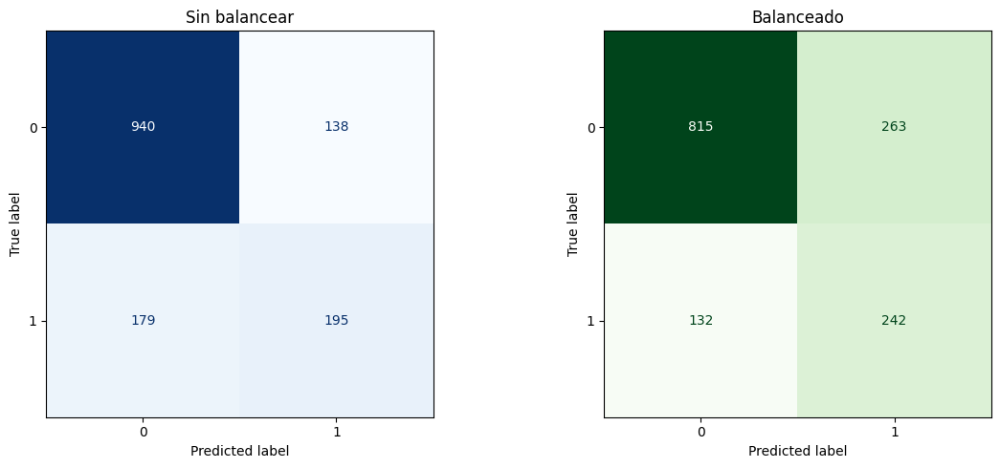
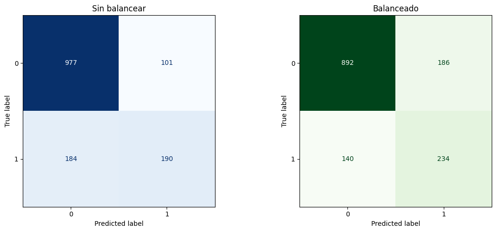

# Telecom X Predicción de Cancelación (Churn)
## 🧭 Misión
Desarrollar modelos predictivos capaces de prever qué clientes tienen mayor probabilidad de cancelar sus servicios. Este repositorio contiene el pipeline de modelado, evaluación e interpretación de resultados que continúa el trabajo de limpieza y EDA realizado en la [Parte 1](https://github.com/OctavioPinoRosas/ChallengeTelecomX.git).

## 🎯 Objetivos
- Preparar los datos para el modelado (tratamiento, codificación, normalización cuando aplique).
- Realizar análisis de correlación y selección de variables.
- Entrenar múltiples modelos de clasificación (baseline, Árbol de Decisión y Random Forest).
- Evaluar el rendimiento con métricas y matrices de confusión.
- Interpretar resultados: importancia de variables y principales factores que influyen en la cancelación.
- Elaborar conclusiones y una estrategia de retención basada en los hallazgos.

## 📦 Datos (Entrada)
Fuente: [archivo CSV](https://github.com/OctavioPinoRosas/ChallengeTelecomX/blob/main/DataBase/TelecomXData.csv) tratado en la Parte 1 (limpio, columnas relevantes y estandarizadas).  
Ruta sugerida: `DataBase/TelecomXData.csv`  
Target: columna binaria de cancelación (por ej., Churn = 0/1).  

🛠️ Preparación de los datos
- Extracción: carga del CSV tratado (uso de pandas).
- Eliminación de columnas irrelevantes: IDs u otros identificadores sin valor predictivo.
- Transformaciones: manejo de nulos, tipos y estandarización cuando aplique.
- Encoding: variables categóricas → numéricas con `pd.get_dummies(drop_first=True)`.
- Balance de clases: análisis de proporciones; aplicación de oversampling (SMOTE) cuando corresponde.
- Separación de datos: `train_test_split` (80/20) con `stratify`.

## 📈 Correlación y Análisis Dirigido
- Matriz y mapa de calor de correlación para variables numéricas.
- Análisis dirigido de relaciones con churn, ejemplos:
- Tiempo de contrato × Cancelación
- Gasto total × Cancelación
- Visualizaciones (boxplots / scatter) para patrones y tendencias.

## 🧪 Modelos de  Machine Learnong
1. Baseline (Dummy)
Modelo de referencia para contextualizar mejoras. Métricas: accuracy, precision, recall, F1 y matriz de confusión.
2. Decision Tree Classifier
Configuraciones: versión sin balanceo y con balanceo (Oversampling `SMOTE`).
Búsqueda de hiperparámetros y validación cruzada.
Matriz de confusión e interpretación de errores.
3. RandomForestClassifier
Configuraciones: versión sin balanceo y con balanceo (Oversampling `SMOTE`)
Búsqueda de hiperparámetros y validación cruzada.
Matriz de confusión e interpretación de errores.

## 🔍 Mejores Hiperparámetros (ejemplos obtenidos)
Los mejores parámetros pueden variar según la semilla y el preprocesamiento. A continuación, ejemplos registrados durante los experimentos:
**1. Modelo DecisionTreeClassifier**
    - Modelo con datos no balanceados
        ```
        {
        'max_depth': 5
        }
        ```
    - Modelo con datos balanceados
        ```
        {
        'max_depth': 11
        }
        ```
2. RandomForestClassifier
    - Modelo con datos no balanceados
        ```
        {
        'max_depth': 10,
        'max_features': 'sqrt',
        'min_samples_leaf': 4,
        'min_samples_split': 10,
        'n_estimators': 200,
        }
        ```
    - Modelo con datos no balanceados
        ```
        {
        'max_depth': None,
        'max_features': 'sqrt',
        'min_samples_leaf': 2,
        'min_samples_split': 2,
        'n_estimators': 300,
        }
        ```
## 📊 Resultados (Test)

- **Resumen por escenario (clase positiva = churn (Cancelación) = 1):**

|Modelo	      |Balanceo |Accuracy  |Precision |Recall (clase 1) | F1-score (clase 1)|
|-------------|---------|----------|----------|-----------------|-------------|        
|DecisionTree | No      | 0.78	   | 0.59     | 0.52	        | 0.55 |
|DecisionTree |	Sí      | 0.73 	   | 0.48	  | 0.65            | 0.55 |
|RandomForest |	No      | 0.80	   | 0.61     | 0.51	        | 0.57 |
|RandomForest |	Sí      | 0.78     | 0.56     | 0.63	        | 0.59 |

- **Matriz de confusión:**  

    **1. Modelo DecisionTreeClassifier**  
      
    

    **2. RandomForestClassifier**  

    

## 🧠 Principales Factores que Influyen en la Cancelación
Basado en importancias del modelo y análisis dirigido.

1. Factores que aumentan la probabilidad de churn
    - Contratos mensuales frente a períodos más largos.
    - Cargos adicionales elevados (servicios extras no percibidos como valor).
    - Baja permanencia (clientes nuevos/recientes).
    - Ausencia de paquetes/beneficios (descuentos, combos, fidelización).

2. Factores que disminuyen la probabilidad de churn
    - Contratos anuales o de mayor duración.
    - Descuentos o programas de fidelidad.
    - Antigüedad alta (clientes con mayor tenure).
    - Soporte y atención al cliente consistentes.

## ✅ Selección del Modelo
Modelo elegido: **RandomForestClassifier** con balanceo (Oversampling `SMOTE`).  
Motivo: mejor recall y F1 de la clase 1, que es prioritaria para retención de clientes.  
Trade-off aceptado: ligera reducción de accuracy global frente a una mejor detección de verdaderos positivos (clientes que realmente cancelan).  

## 🧩 Estrategia de Retención (a partir de los hallazgos)
- Ofertas proactivas a clientes con alto riesgo (descuentos, paquetes).
- Fidelización por contrato: incentivos por migrar de mensual a anual/bianual.
- Alertas tempranas: monitoreo de señales (baja permanencia, quejas, tickets frecuentes).
- Optimización de precios: revisar cargos adicionales y percepción de valor.

## 🗂️ Estructura del Repositorio
```
TelecomX-PredicciónDeCancelacion/
├─ 📂Assets/
│ └─ DecisionTreeClassifier.png
│ └─ RandomForestClassifier.png
├─ 📂DataBase/
│ └─ TelecomXData.csv
├─ 📂Metadata/
│ └─ TelecomX_diccionario.md
├─ 📂Notebooks
│ └─ TelecomX_PrediccionDeCancelacion.ipynb
├─ 📄README
└─ 📄requirements.txt
```

## 📄 Requisitos
Dependencias (requirements.txt):
```bash
python==3.10.8
pandas==2.3.0
numpy==1.26.4
scikit-learn==1.3.2
imbalanced-learn==0.11.0
matplotlib>=3.9.2
seaborn==0.13.2
plotly==6.2.0
jupyterlab
```

## ▶️ Instalar y ejecutar
1. Clona este repositorio:  
`https://github.com/OctavioPinoRosas/TelecomX-PrediccionDeCancelacion.git`
2. (Opcional pero recomendado) Crea un entorno virtual:
    ```bash
    python -m venv venv
    source venv/bin/activate   # En Linux/Mac
    venv\Scripts\activate      # En Windows
    ```
3. Instala las dependencias:  
`pip install -r requirements.txt`
4. Ejecuta el notebook y ejecuta cada sección en orden

## 🧪 Reproducibilidad
Fijar semillas: random_state=42 (o la que prefieras) en `train_test_split`, `SMOTE` y modelos.

## 📜 Licencia
Este proyecto se publica bajo licencia MIT.

## 👤 Autor
**Octavio Pino Rosas**  
[](https://www.linkedin.com/in/octavio-pino-rosas)  
Email: 📧 octaviopinoross@gmail.com

**¿Sugerencias? ¡Abre un issue, envía un pull request o enviame un mensaje/email! 🙌**